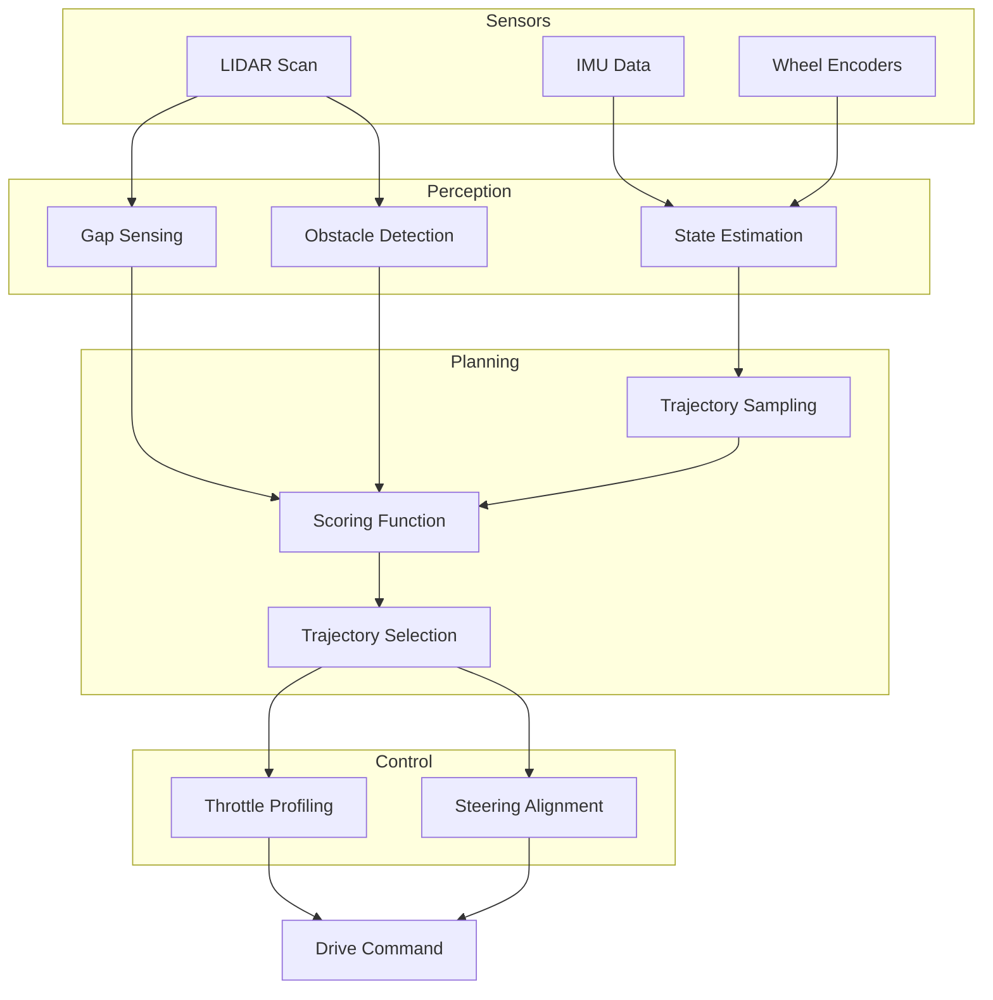

# RoboRacer Sim Racing League - ICRA 2026
## Team Innomer (Mann Bhanushali)

This repository contains the autonomous racing software developed for the **RoboRacer Sim Racing League** at ICRA 2026. Our approach combined sampling-based trajectory optimization (Rollouts) with a rigorous, data-driven parameter tuning pipeline.

### 🏆 Achievements ([Link](https://autodrive-ecosystem.github.io/competitions/roboracer-sim-racing-icra-2026/#results))
*   **Qualifications**: **3rd Place** overall.
    *   Best Lap: **7.84s**
    *   Total Time: **79.34s**
*   **Finals**: **8th Place** overall.
    *   Best Lap: **16.21s**
    *   Total Time: **164.29s**
 
Note: Race Videos are available on my [website](https://www.mannbhanushali.com/projects).

---

## 🛠 Technical Approach: "Robust Rollout Racer"

The core navigation logic is based on a Sampling-Based Trajectory Rollout Planner operating in a receding-horizon fashion. At every LiDAR update, the vehicle generates a set of candidate steering trajectories using a kinematic bicycle model, evaluates them using a multi-objective cost function, and selects the safest and most promising path for execution

### 1. System Architecture


### 2. Perception & Obstacle Avoidance
*   **Gap Sensing**: Identifying navigable openings in the LIDAR field to guide trajectory sampling.
*   **Disparity Extension** [Inspired by UNC Chapel Hill's Team's Approach](https://www.nathanotterness.com/2019/04/the-disparity-extender-algorithm-and.html): A crucial safety feature that identifies sudden "jumps" in LIDAR depth data (disparities). The system extends the nearer obstacle's distance across a calculated angular width (safety bubble) to prevent the vehicle from clipping corners or "cutting" too close to obstacles.
*   **State Estimation**: Fusing Wheel Encoders and IMU data (Yaw Rate) to maintain accurate vehicle odometry and heading.

### 3. Trajectory Rollouts, Evaluations & Tracking
The racer generates a set of candidate steering angles and projects the vehicle's path forward using a **Kinematic Bicycle Model**. Each rollout represents a feasible future vehicle path and is evaluated using a weighted scoring function:
*   **Progress**: Maximizing forward distance along the track.
*   **Clearance**: Maintaining safe distance from walls and obstacles (LIDAR-based).
*   **Smoothness**: Penalizing high-frequency steering changes to maintain vehicle stability.
*   **Gap Alignment**: Prioritizing paths that lead toward identified gaps in the LIDAR field.
*   **Turn Commitment**: Biasing towards existing turning directions to prevent "steering chatter."

The highest-scoring rollout is selected as the local plan and tracked using a Pure Pursuit controller to generate the final steering command.

### 3. Data-Driven Optimization (Qualifications)
Our 3rd place qualification was driven by an automated **Hyperparameter Tuning Pipeline**.
*   **Exhaustive Search**: A custom dashboard (`racer_tuner.py`) ran hundreds of automated simulations with varying parameter grids.
*   **Random Forest Analysis**: We utilized a Random Forest Regressor to analyze the impact of different parameters on lap times and collision rates, allowing us to focus on high-impact weights.
*   **Automated Resets**: The system automatically detected failures (collisions/stuck) and reset the environment to continue the optimization loop without human intervention.

### 4. High-Performance C++ Implementation (Finals)
For the final race, we ported the Python implementation to **C++** to reduce control latency and implemented several robustness enhancements:
*   **Low Latency Control**: Real-time rollout evaluation and path tracking at high frequencies.
*   **Stuck Recovery**: Logic to detect when the car is wedged or blocked, triggering reverse-and-realign maneuvers.
*   **Corner Turn Assist**: Specialized logic for handling sharp bends by dynamically adjusting lookahead distances and steering commitment.
*   **Advanced Scoring**: Improved wall-clearance penalties and multi-stage throttle ramping.

---

## 📁 Repository Structure
*   `src/qualifications/`: Original Python implementation, tuning scripts, and optimization data.
*   `src/finals/`: Optimized C++ implementation with advanced recovery features.

---

## 🚀 How to Run

### Requirements
*   ROS 2 (Humble/Foxy)
*   RoboRacer Simulation Environment

### Build
```bash
colcon build --packages-select custom_codes_cpp custom_codes
```

### Launch
**Finals (C++):**
```bash
ros2 launch custom_codes_cpp racer_cpp.launch.py
```

**Qualifications (Python):**
```bash
ros2 launch custom_codes racer.launch.py
```

---

## 📈 Performance Visuals
*(Note: Visuals and analysis plots can be found in `src/qualifications/custom_codes/`)*

*   **`race_team_exhaustive_analysis.png`**: Heatmaps and importance plots from the tuning phase.
*   **`parameter_importance.csv`**: Raw data from the Random Forest importance analysis.

---

## 👨‍💻 Team
**Team Innomer**
Participating in the RoboRacer Sim Racing League, ICRA 2026.
